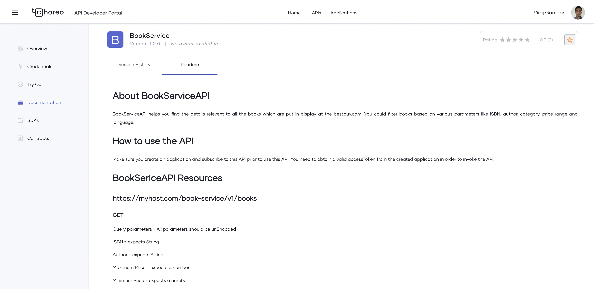

# API Documentation

When an API consumer logs in to the DevPortal and browse APIs, just having API will not be sufficient. The consumer may expect a detailed explainataion on details like,
    - What is this API is about
    - How to invoke this API
    - What are the limitations/restrictions associated with this particular API

etc. As a API developer, choreo has capability add necessary documentation as a markdown file to serve this purpose.

## Add Documentation to an API

To add documentation for an API, follow the steps given below.

1. Sign in to the Choreo Console at [https://console.choreo.dev/](https://console.choreo.dev/).

2. Select and click on the API component you want to test from the components list. 

3. in the left panel, click the **Manage** icon to open the test view.

4. In the left pane, click **Documentation**.

5. Then add a title to the document and provide the content in markdown syntax. After content is complete, make sure you click **Add** to save the documentation.

6. In addition, the developer can add multiple documents, edit the available documents and delete them too.

## View Documentation of an API

To view documentation for an API, the API should be in Published lifecycle state.

1. Sign in to the Choreo DevPortal at [https://devportal.choreo.dev/](https://devportal.choreo.dev/).

2. Click on APIs tab.

3. Pick the API you need to explore and click **Documentation**. Here is how it looks like in the DevPortal. 

{.cInlineImage-full}
